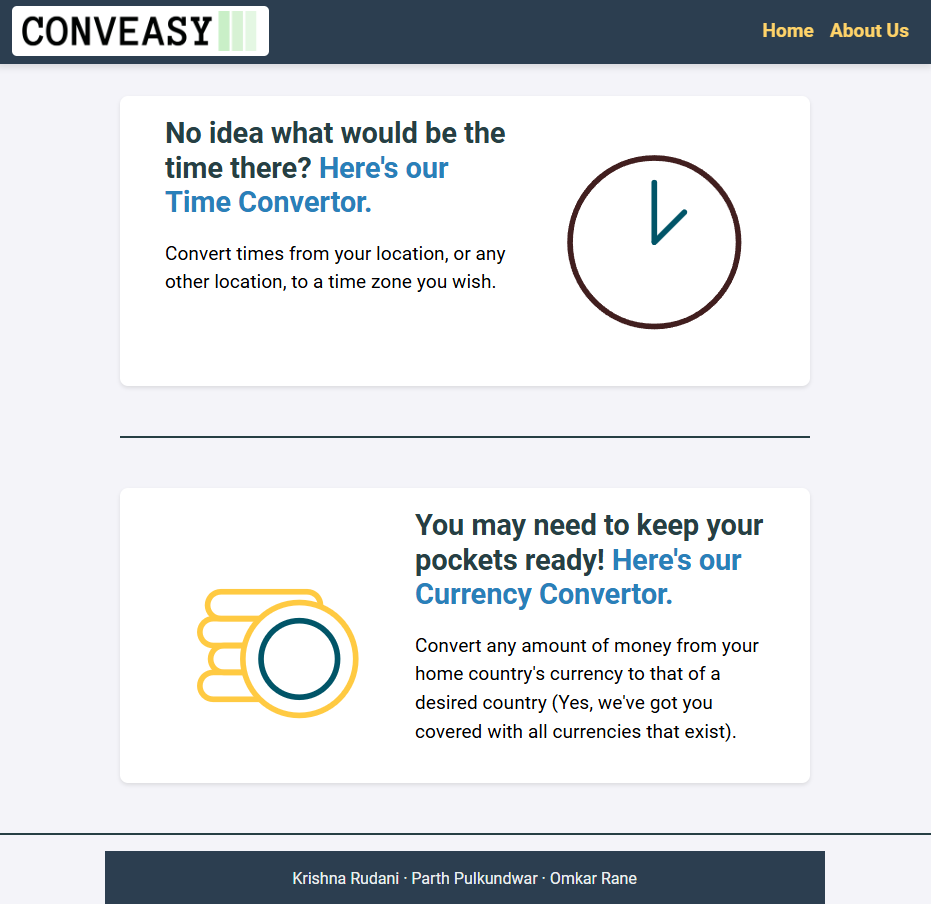

# Conveasy

Conveasy is a web application providing two essential utilities: Time Conversion and Currency Conversion. This project was developed as part of our coursework in Semester III of Computer Engineering at Mumbai University.

<div align="center">
  
</div>


## Features

- **Time Conversion**: Convert time across different time zones.
- **Currency Conversion**: Convert between all world currencies.

## Technologies Used

- **HTML**
- **CSS**
- **JavaScript**
- **Bootstrap 5**
- **APIs** for fetching conversion rates

## Recent Updates

- Added support for all world currencies on the currency conversion page.
- Updated page titles to "Conveasy | Time Convertor" and "Conveasy | Currency Convertor".
- Added logo to the browser tab display.

## Getting Started

To run the project locally, clone the repository and open `index.html` in your browser.
```bash
git clone https://github.com/pulkundwar29/Conveasy
cd Conveasy
```
In `src/html`, open the `index.html` file. This is the landing page of the application.
